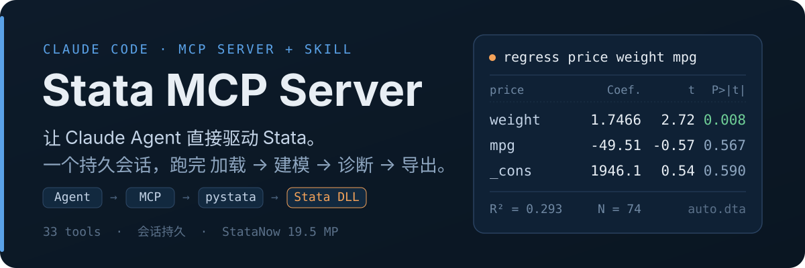
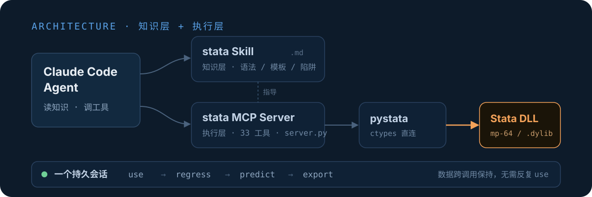

<p align="center">
  
</p>

<p align="center">
  <a href="https://www.stata.com"></a>
  <a href="https://python.org"></a>
  <a href="https://modelcontextprotocol.io"></a>
  
  
</p>

在 Claude Code 里用自然语言做 Stata 分析。你描述要什么，Agent 自己写命令、执行、
读结果、继续下一步 —— 加载数据、清洗、建模、诊断、导出，全在**一个持久的 Stata
会话**里完成，数据不用反复载入。

## 一句话，跑完整个分析

> **你：** 加载 auto.dta，用 weight 和 mpg 回归 price，并检查异方差

**Agent 自动完成（无需你写任何 Stata 命令）：**

```text
stata_use_dataset("auto.dta")          →  74 obs, 12 vars 已载入
stata_regress("price", "weight mpg")   →  R² = 0.293 ; weight 1.75 (p=0.008)
stata_run("estat hettest")             →  Breusch–Pagan χ² 检验异方差
stata_graph("rvfplot", export="…png")  →  残差图导出为文件
```

数据从第一步起就留在内存里，后面每一步都接着用 —— 这正是 `stata_run("regress …")`
之外还值得有一个 MCP Server 的原因。

## 这是什么

两部分组成，一起装进 Claude Code：

- **执行层（MCP Server）** —— 经 `pystata` 直接调用 Stata 的运行时，把 49 个工具
  暴露给 Agent。`stata_run` 执行任意命令、`stata_help` 查任意命令的官方语法，二者
  合起来即「全量内置命令支持」；其余专用工具（回归 / 面板 / IV / 生成变量 …）是给
  高频命令加结构化参数与校验的便利层。
- **知识层（Skill）** —— 一份 Stata 编程指南：语法要点、分析模板、常见陷阱、命令
  地图与常用外置包。Agent 据此知道**该用什么命令**，而不是靠猜。

## 为什么是 pystata，而不是 subprocess

`pystata` 通过 ctypes 在**进程内**加载 Stata 运行时，而非每条命令起一个子进程：

- **真会话持久** —— Stata 在 MCP Server 启动时初始化一次，数据集、估计结果、局部
  宏在所有工具调用之间保持。多步分析（加载 → 清洗 → 回归 → 诊断）就是自然的对话。
- **低延迟** —— 无进程启动开销，单条命令约 12ms。
- **输出可控** —— 直接读 Stata 输出缓冲；大输出自动分页（`stata_more` 翻页），
  硬上限 120K 字符防止撑爆 MCP 通道；长命令有 60s 超时看门狗（可显式调大）。

## 架构

<p align="center">
  
</p>

## 快速开始

### 前置条件

- **Stata**：StataNow 19 或 Stata 18+（MP / SE / BE 均可）——需含 `utilities/pystata`
- **Python** 3.10+（推荐 3.12+）
- **Claude Code** 最新版
- **操作系统**：Windows 或 macOS（见下方「兼容性」）

### 一键安装

```bash
git clone https://gitea.aliveranme.space/aliveranme/stata-mcp.git
cd stata-mcp
python setup.py
```

> 装在非标准位置（如外置卷 `/Volumes/xxx/Applications/StataNow`）时自动检测会失败 ——
> 先 `export STATA_HOME=/你的/Stata路径` 再跑 `setup.py` 即可。

`setup.py` 会：检测 Stata 安装（常见路径 + `STATA_HOME` 环境变量，跨平台）→
创建虚拟环境并安装 `fastmcp` → 生成 `.mcp.json`（保留你已有的其他 MCP Server 配置）
→ 验证 Server 可启动。

<details>
<summary><b>手动安装（自动检测失败时）</b></summary>

```bash
# 1. 指定 Stata 路径（替换为你本机实际路径）
export STATA_HOME="C:/Program Files/StataNow/StataNow19"   # Windows
# export STATA_HOME="/Applications/Stata"                  # macOS
export STATA_EDITION=mp                                     # mp / se / be

# 2. 建虚拟环境并装依赖
cd mcp-stata-server
uv venv
source .venv/Scripts/activate      # Windows Git Bash
# source .venv/bin/activate        # macOS / Linux
uv pip install fastmcp

# 3. 生成配置
cd ..
cp .mcp.json.example .mcp.json     # 编辑其中的 <repo-path>
```
</details>

### 连接并验证

重启 Claude Code（或 `/reload-plugins`），`.mcp.json` 里的 `stata` Server 会自动连接。
然后在对话里直接说：

> 帮我加载 auto.dta 并做描述统计

Agent 会自动走 `stata_use_dataset` → `stata_describe` → `stata_summarize`。

## MCP 工具（49 个）

> 能力边界不在工具数量上：`stata_run` + `stata_help` 已覆盖全部内置命令。下面的
> 专用工具是给高频命令加结构化参数与校验的便利层。

| 类别 | 工具 |
|------|------|
| **核心执行** | `stata_run`（任意命令，含危险前缀拦截）· `stata_run_do_file`（执行前自动拆出 `ssc install` 单独安装，已装跳过） |
| **数据管理** | `stata_use_dataset` · `stata_import`（excel/csv/sas/spss/dbase/parquet）· `stata_use_example`（sysuse/webuse）· `stata_save_dataset` · `stata_set_cwd` · `stata_generate` · `stata_egen` · `stata_xtset`（面板/时序声明） |
| **数据重构 / 校验** | `stata_merge` · `stata_append` · `stata_reshape` · `stata_collapse` · `stata_frame`（多数据集）· `stata_verify`（count/assert/duplicates/isid/missing） |
| **数据探索** | `stata_describe` · `stata_codebook` · `stata_summarize` · `stata_list` · `stata_tabulate` · `stata_correlate` · `stata_display` |
| **估计** | `stata_regress` · `stata_logistic` · `stata_probit` · `stata_poisson` · `stata_ttest` · `stata_xtreg` · `stata_ivregress` |
| **后估计** | `stata_margins` · `stata_test` · `stata_predict` · `stata_estat`（vif/hettest/ovtest/ic）· `stata_estimates`（存取与并排比较）· `stata_return_list` |
| **图形 / 导出** | `stata_graph`（导出即验证文件写入）· `stata_scheme`（主题）· `stata_export_excel` · `stata_export_delimited` |
| **包管理与帮助** | `stata_help`（查任意命令帮助）· `stata_install_package` · `stata_uninstall_package` · `stata_describe_package` · `stata_find_package` · `stata_list_packages` |
| **会话** | `stata_more`（翻页）· `stata_status` · `stata_ping` |

<details>
<summary><b>各工具的参数与说明</b></summary>

**数据管理** — `stata_use_dataset` 加载 .dta（可只载入子集）；`stata_import` 覆盖官方
import 命令族，按扩展名推断格式；`stata_save_dataset` 保存；`stata_set_cwd` 改工作目录；
`stata_generate` / `stata_egen` 创建变量（支持官方 `[type]` 存储类型与 `[if] [in]`）；
`stata_xtset` 声明面板 / 时序结构 —— 它是 `stata_xtreg` 的前提。

**数据探索** — `stata_summarize` / `stata_codebook` / `stata_list` / `stata_tabulate`
均支持 `condition`；`stata_correlate` 可选 `pairwise` 走 `pwcorr`；`stata_display`
算表达式 / 看返回值。

**估计** — `stata_regress`（OLS）、`stata_logistic`、`stata_probit`（可选
`marginal_effects`）、`stata_poisson`（可选 `irr`）、`stata_ttest`（可按组）、
`stata_xtreg`（`effects` = fe/re/be/mle/pa，需先 `xtset`）、`stata_ivregress`
（2sls/liml/gmm）。

**后估计**（须先跑估计命令）— `stata_margins`（`dydx` / `at`）、`stata_test`
（Wald 检验）、`stata_predict`（预测值 / 残差，会创建变量）。

**图形 / 导出** — `stata_graph` 把 graph 与 export 原子执行，以文件是否真被写入判定
成败。导出选项按格式自动适配官方边界：尺寸单位（位图与 svg 用像素、pdf 用英寸、
eps/ps/emf 不支持）、`quality`（仅 jpg）、`mag`（仅 pdf/eps/ps）、`fontface`
（仅矢量格式）—— 不适用的选项被丢弃并在返回信息中说明，而非让 Stata 静默失败。
`stata_scheme` 列出 / 查询 / 设置主题（不传 `scheme` 时**不会**改动你当前的主题）。
`stata_export_excel` 导数据为 .xlsx（支持 `sheet_mode` / `cell` / `firstrow` /
`if`-`in` 筛选），回归结果导为 CSV；`stata_export_delimited` 导 CSV / TSV /
自定义分隔符。

**包管理与帮助** — `stata_help("命令")` 查任意内置 / 已装外置命令的官方语法；
`stata_find_package` 走 `net search` 联网找包；`stata_install_package` 装（ssc 或 URL）；
`stata_uninstall_package` 卸载（`ado uninstall`，纯本地）；`stata_describe_package`
查包详情（默认本地 `ado describe`，`source="ssc"` 走联网 `ssc describe` 供装前了解）；
`stata_list_packages` 列已装。

**会话** — `stata_more` 翻上一条命令的完整输出；`stata_status` 一次给出数据集、工作目录、
**frame**、**面板/时序设定**、**已存与活跃的估计结果**、内存 —— 即 Agent 调 `xtreg` /
`margins` / `predict` 前需要确认的全部前提；`stata_ping` 心跳。
</details>

## Stata 知识 Skill

`.claude/skills/stata/SKILL.md` 是 Agent 的 Stata 编程参考：

| 模块 | 内容 |
|------|------|
| 核心原则 | 分析前先探数据、变量名大小写、路径规范、返回值检查 |
| 语法要点 | 命令结构、`if` 条件陷阱、因子变量、循环与条件块、egen 函数 |
| 命令地图 | 3500+ 内置命令按族归类，语法一律指向 `stata_help` |
| 分析模板 | 数据探索、OLS / Logit、面板、工具变量、DID —— 均经真实 Stata 验证 |
| 外置命令表 | reghdfe / ivreg2 / estout / coefplot / did / rdrobust … 按计量方向组织 |
| 常见陷阱 | 变量名冲突、缺失值、字符串转换、路径、do 文件 |

## 兼容性

| 组件 | 要求 |
|------|------|
| **Stata** | StataNow 19 / Stata 18（MP / SE / BE），需含 `utilities/pystata` |
| **Python** | 3.10+ |
| **Claude Code** | 最新版（支持 MCP stdio） |
| **操作系统** | Windows、macOS（`setup.py` 跨平台检测；Linux 亦受 `setup.py` 支持但未实测） |

> `pystata` 是 Stata 官方的 Python 集成，随 Stata 一同分发，Windows / macOS / Linux
> 均提供。本项目在 Windows 与 macOS（StataNow 19.5 MP）上均实测可用。

## 配置

<details>
<summary><b>环境变量</b></summary>

| 变量 | 默认值 | 说明 |
|------|--------|------|
| `STATA_HOME` | `C:\Program Files\StataNow\StataNow19` | Stata 安装目录。环境变量优先级最高；未设置时由 `setup.py` 自动检测。 |
| `STATA_EDITION` | `mp` | Stata 版本（mp / se / be） |
| `STATA_ALLOWED_ROOTS` | 未设置 | 路径沙箱白名单，分号分隔（例 `C:/data;D:/projects`）。未设置时不限制绝对路径；**即便设置也只校验工具的路径参数**，不覆盖 `stata_run` 里的自由文本命令。 |
| `STATA_ALLOW_UNC` | 未设置 | 设为 `1` 允许 UNC 网络路径，默认拒绝。 |
</details>

<details>
<summary><b>开发 / 调试</b></summary>

```bash
# 调试模式启动 Server
cd mcp-stata-server
source .venv/bin/activate          # 或 .venv/Scripts/activate (Windows)
python server.py

# 单元测试（无需 Stata）
python -m pytest tests/ -q

# 端到端测试（需真实 Stata；未检测到安装时整目录跳过）
# 必须与 tests/ 分开跑：tests/conftest.py 会把 pystata 换成 mock，同进程内换不回来
STATA_HOME=/path/to/StataNow python -m pytest tests_e2e/ -q

# lint
python -m ruff check server.py tests/ tests_e2e/
python -m ruff check --config pyproject.toml ../setup.py

# 添加依赖
uv pip install <package>
uv pip freeze > requirements.txt
```
</details>

## 项目结构

```text
stata-mcp/
├── setup.py                        # 一键安装（跨平台检测 Stata）
├── mcp-stata-server/
│   ├── server.py                   # MCP Server 主程序（49 个工具）
│   ├── tests/                      # 单元测试（mock pystata，无需 Stata）
│   └── tests_e2e/                  # 端到端测试（需真实 Stata）
├── .claude/skills/stata/SKILL.md   # Stata 编程知识 Skill
├── assets/readme/                  # README 视觉资产
└── .mcp.json                       # Server 配置（setup.py 生成）
```

## 许可证

MIT License
